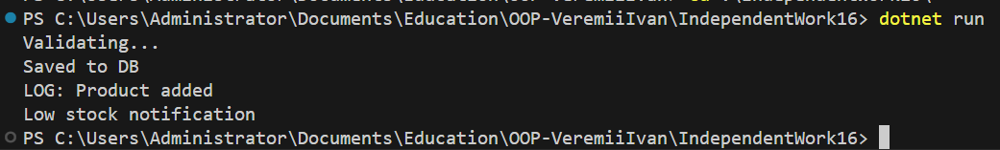

# IndependentWork16 — SRP Refactoring

## Опис роботи
Проєкт демонструє застосування принципу єдиної відповідальності (Single Responsibility Principle, SRP) та принципу інверсії залежностей (Dependency Inversion Principle, DIP) шляхом рефакторингу модуля управління продуктами.

Спочатку було реалізовано клас, який виконує кілька відповідальностей одночасно, що порушує принципи об’єктно-орієнтованого програмування. Після цього функціональність була декомпозована на окремі компоненти.

---

## Мета роботи
Метою роботи є:
- вивчення принципу SRP;
- декомпозиція складного класу на окремі модулі;
- використання інтерфейсів для зменшення зв’язаності;
- демонстрація модульної архітектури програми.

---

## Принцип єдиної відповідальності (SRP)
Принцип SRP стверджує, що кожен клас повинен мати лише одну відповідальність і одну причину для зміни. Це спрощує підтримку, тестування та розширення програмного коду.

---

## Початковий клас та його проблеми
Початковий клас виконував декілька функцій одночасно: валідацію даних, збереження інформації, логування та сповіщення. Такий клас є прикладом “God Object” і порушує принцип SRP, оскільки має багато причин для зміни.

---

## Рефакторинг і декомпозиція
Для дотримання SRP функціональність була розділена на окремі компоненти:
- модуль валідації даних;
- модуль збереження даних;
- модуль логування;
- модуль сповіщення про низький запас;
- сервісний клас, який координує роботу компонентів.

Кожен компонент має одну відповідальність, що підвищує гнучкість і масштабованість системи.

---

## Принцип інверсії залежностей (DIP)
Основний сервісний клас залежить від абстракцій (інтерфейсів), а не від конкретних реалізацій. Це дозволяє легко змінювати реалізації компонентів без зміни бізнес-логіки програми.

---

## Демонстрація роботи
У методі Main створюються екземпляри компонентів і передаються в сервісний клас. Далі викликається метод додавання продукту, що демонструє взаємодію модулів і вивід результатів у консоль.

---

## Результат

---

## Висновок
У ході виконання роботи було реалізовано декомпозицію складного модуля відповідно до принципу SRP. Архітектура системи стала більш модульною, зрозумілою та придатною до розширення і тестування.