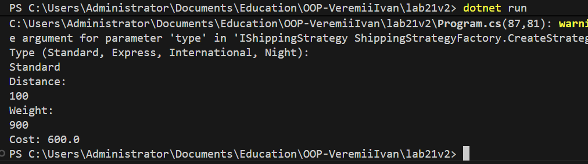

# Лабораторна робота №21  
## Тема: OCP – гнучкі алгоритми розрахунку (Factory Method + Strategy)

---

## Мета роботи
Метою лабораторної роботи є застосування принципу відкритості/закритості (Open/Closed Principle, OCP) та патернів проєктування Factory Method і Strategy для створення гнучкої системи розрахунку вартості доставки, яку можна розширювати без зміни існуючого коду.

---

## Опис завдання
Було створено консольний проєкт **lab21**, у якому реалізовано систему розрахунку доставки з використанням різних стратегій обчислення вартості.

Система дозволяє:
- динамічно змінювати алгоритм розрахунку доставки;
- додавати нові стратегії без зміни бізнес-логіки;
- використовувати фабрику для створення потрібної стратегії.

---

## Використані патерни проєктування

### Strategy
Патерн Strategy використано для реалізації різних алгоритмів розрахунку доставки.  
Кожна стратегія реалізує єдиний інтерфейс і може бути підставлена під час виконання програми.

### Factory Method
Патерн Factory Method використано для створення стратегій доставки на основі введеного типу доставки.

### Принцип OCP (Open/Closed Principle)
Система відкрита для розширення (можна додати нову стратегію доставки), але закрита для модифікації (не потрібно змінювати існуючі класи сервісу доставки).

---

## Реалізовані стратегії доставки
- **StandardShippingStrategy** – стандартна доставка за базовим тарифом.  
- **ExpressShippingStrategy** – швидка доставка з підвищеним тарифом та фіксованою доплатою.  
- **InternationalShippingStrategy** – міжнародна доставка з податком.  
- **NightShippingStrategy** – нічна доставка з додатковою фіксованою націнкою (демонстрація OCP).

---

## Архітектура системи
Основні компоненти:
- **IShippingStrategy** – інтерфейс стратегії доставки.
- **ShippingStrategyFactory** – фабрика для створення стратегій.
- **DeliveryService** – сервіс, що виконує розрахунок доставки і не залежить від конкретних стратегій.
- **Program (Main)** – демонстрація роботи програми.

---

## Демонстрація роботи програми
Програма запитує у користувача:
1. Тип доставки  
2. Відстань  
3. Вагу  

Після цього система:
- створює відповідну стратегію через фабрику;
- обчислює вартість доставки;
- виводить результат у консоль.

---

## Скріншот результату роботи програми

---

## Висновок
У ході виконання лабораторної роботи було застосовано принцип відкритості/закритості (OCP) 
та реалізовано патерни Strategy і Factory Method.  
Система доставки була побудована таким чином, що нові алгоритми розрахунку можуть 
додаватися без зміни існуючого коду сервісу доставки.  
Це демонструє гнучкість архітектури та переваги використання патернів проєктування 
в об’єктно-орієнтованому програмуванні.
