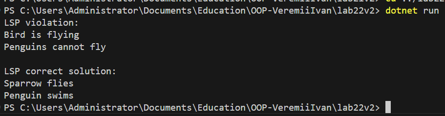

# Лабораторна робота №22 – LSP: виявлення порушень і альтернативи

## Мета
Поглибити розуміння принципу підстановки Лісков (LSP), навчитися ідентифікувати його порушення
в ієрархіях класів та застосовувати альтернативні підходи (композиція, зміна ієрархії)
для створення LSP-сумісних рішень.

---

## Хід роботи
1. **Реалізовано початкову ієрархію класів, яка порушує LSP**
   - Базовий клас `Bird` з методом `Fly()`.
   - Похідний клас `Penguin`, який кидає виняток при виклику `Fly()`.
   - Показано, що клієнтський код, який очікує, що будь-який `Bird` може літати, працює некоректно.

2. **Аналіз порушення LSP**
   - Виявлено, що похідний клас змінює контракт базового класу.
   - Порушення полягає у тому, що клієнт не може безпечного використовувати об’єкт підкласу, очікуючи поведінку базового класу.

3. **Розроблено альтернативне LSP-сумісне рішення**
   - Використано **інтерфейси** для розділення обов’язків:
     - `IBird` – загальні методи для всіх птахів (наприклад, рух).
     - `IFlyingBird` – методи для літаючих птахів (літання).
   - `Sparrow` реалізує обидва інтерфейси, `RealPenguin` – тільки `IBird`.
   - Клієнтський код адаптовано під інтерфейси, що дозволяє безпечно працювати з усіма типами птахів.

4. **Демонстрація коректної роботи**
   - Викликано методи літаючого птаха (`Sparrow`) і нелітаючого (`RealPenguin`).
   - Показано, що порушення LSP усунено, клієнтський код працює коректно.

---

## Результат

---

## Висновки
- Принцип підстановки Лісков забезпечує безпечну заміну базового класу похідними класами без порушення очікуваної поведінки.
- Використання інтерфейсів або композиції допомагає уникати порушень LSP.
- Альтернативне рішення підвищує гнучкість і правильність роботи клієнтського коду.