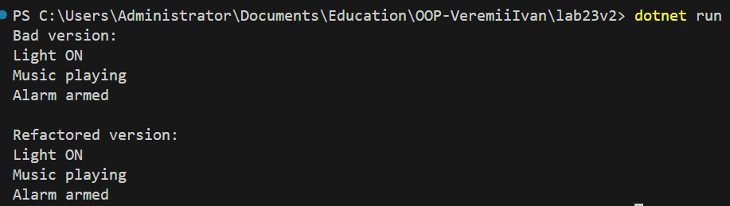

# Lab23 -- ISP & DIP + Dependency Injection

## Тема

Застосування принципів ISP (Interface Segregation Principle) та\
DIP (Dependency Inversion Principle) з виконанням рефакторингу та
реалізацією Dependency Injection через конструктор.

Варіант: Smart Home Hub (SmartHomeCentral)

---

# Мета роботи

-   Проаналізувати код із порушеннями принципів SOLID.
-   Виявити порушення ISP та DIP.
-   Виконати рефакторинг із виділенням вузьких інтерфейсів.
-   Реалізувати Dependency Injection через конструктор.
-   Продемонструвати зменшення зв'язаності системи.

---

# Опис предметної області

SmartHomeCentral --- центральний модуль розумного будинку, який керує: -
освітленням - музикою - сигналізацією

Початкова реалізація мала жорсткі залежності від конкретних класів
пристроїв.

---

# Початкова реалізація (до рефакторингу)

```
class SmartHomeCentral_Bad { private LightController light = new
LightController(); private MusicPlayer music = new MusicPlayer();
private SecurityAlarm alarm = new SecurityAlarm();

    public void ActivateAll()
    {
        light.TurnOn();
        music.Play();
        alarm.Arm();
    }

}
```

---

## Аналіз порушень

### Порушення DIP

Модуль вищого рівня залежить від конкретних реалізацій: -
LightController - MusicPlayer - SecurityAlarm

Це призводить до жорсткого зв'язку та складності заміни реалізацій.

### Порушення ISP

Клієнт змушений залежати від усіх підсистем одразу, навіть якщо
використовує лише одну з них.

---

# Рефакторинг

## Виділення інтерфейсів (ISP)

```
interface ILight { void TurnOn(); } interface IMusic { void Play(); }
interface IAlarm { void Arm(); }
```

## Реалізації

```
class LightDevice : ILight { public void TurnOn() =\>
Console.WriteLine("Light ON"); }

class MusicDevice : IMusic { public void Play() =\>
Console.WriteLine("Music playing"); }

class AlarmDevice : IAlarm { public void Arm() =\>
Console.WriteLine("Alarm armed"); }
```

## Dependency Injection (DIP)

```
class SmartHomeCentral { private readonly ILight light; private readonly
IMusic music; private readonly IAlarm alarm;

    public SmartHomeCentral(ILight l, IMusic m, IAlarm a)
    {
        light = l;
        music = m;
        alarm = a;
    }

    public void ActivateAll()
    {
        light.TurnOn();
        music.Play();
        alarm.Arm();
    }

}
```

---

# Демонстрація роботи

```
Console.WriteLine("Bad version:"); var bad = new SmartHomeCentral_Bad();
bad.ActivateAll();

Console.WriteLine("`\nRefactored `{=tex}version:"); var hub = new
SmartHomeCentral( new LightDevice(), new MusicDevice(), new
AlarmDevice());

hub.ActivateAll();
```

---

# Результат


---

# Висновок

У ході роботи було проаналізовано порушення принципів ISP та DIP. Після
рефакторингу було виділено вузькі інтерфейси та реалізовано Dependency
Injection через конструктор.

Система стала менш зв'язаною, гнучкішою та готовою до розширення без
зміни існуючого коду.
