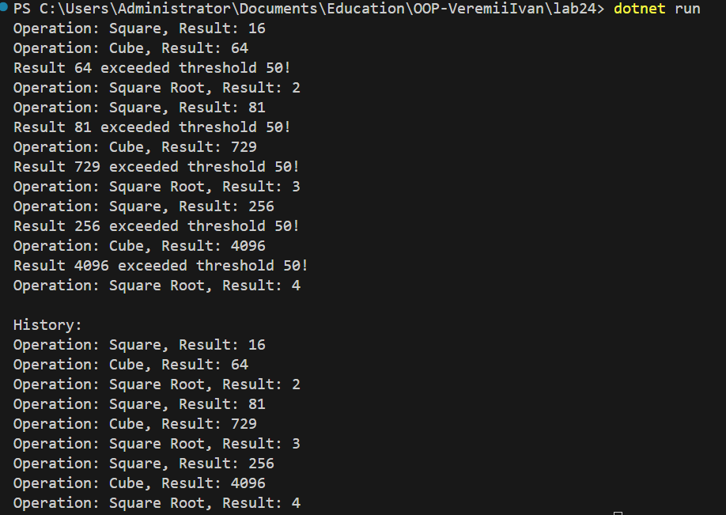

# Lab24 — Strategy + Observer Pattern (Numeric Processing System)

## Опис роботи
У даній лабораторній роботі реалізовано систему обробки числових даних із використанням патернів проєктування **Strategy** та **Observer**.  
Система дозволяє динамічно змінювати алгоритми обчислення та автоматично сповіщати зацікавлені компоненти про результати обробки.

---

## Мета роботи
- Застосувати патерн Strategy для динамічної підстановки алгоритмів обробки даних.
- Реалізувати патерн Observer для автоматичного сповіщення залежних компонентів.
- Продемонструвати взаємодію компонентів у консольному застосунку.
- Показати розуміння принципів модульності та розширюваності програмної архітектури.

---

## Патерн Strategy
Патерн Strategy дозволяє інкапсулювати різні алгоритми в окремі класи та підміняти їх під час виконання програми.

У проєкті реалізовано:
- Інтерфейс стратегії обробки чисел.
- Стратегії обчислення квадрата числа.
- Стратегії обчислення куба числа.
- Стратегії обчислення квадратного кореня числа.
- Клас NumericProcessor, який використовує поточну стратегію та дозволяє змінювати її під час виконання.

Це дозволяє додавати нові алгоритми без зміни існуючого коду.

---

## Патерн Observer
Патерн Observer реалізовано через події мови C#.  
Клас ResultPublisher виступає як суб’єкт, який публікує результати обчислень, а спостерігачі реагують на ці події.

Реалізовано такі спостерігачі:
- ConsoleLoggerObserver — виводить результат у консоль.
- HistoryLoggerObserver — зберігає історію результатів.
- ThresholdNotifierObserver — повідомляє, якщо результат перевищує заданий поріг.

Це забезпечує слабку зв’язаність між компонентами та автоматичне сповіщення.

---

## Демонстрація роботи
У методі Main:
- створюється NumericProcessor із початковою стратегією;
- створюється ResultPublisher;
- створюються та підписуються спостерігачі;
- для кожного числа динамічно змінюється стратегія обробки;
- результати публікуються та обробляються спостерігачами;
- виводиться історія обчислень.

---

## Результат

---

## Переваги архітектури
- Можливість додавання нових алгоритмів без зміни основного коду.
- Автоматичне сповіщення компонентів без жорстких залежностей.
- Висока модульність та розширюваність системи.
- Відповідність принципам SOLID (зокрема SRP та OCP).

---

## Висновок
У лабораторній роботі було реалізовано патерни Strategy та Observer для побудови гнучкої системи обробки числових даних.  
Запропонована архітектура дозволяє легко розширювати функціональність, змінювати алгоритми обробки та додавати нові способи реагування на результати без зміни існуючого коду.
Проєкт демонструє практичне застосування шаблонів проєктування та принципів об’єктно-орієнтованого програмування.