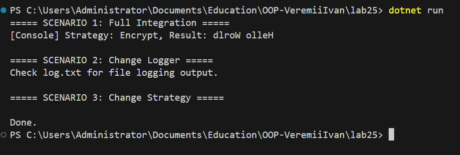

# Лабораторна робота №25  
**Тема:** Реалізація та інтеграція шаблонів проектування (Factory Method, Singleton, Strategy, Observer) у C#

---

## Мета роботи  
Ознайомитися з шаблонами проектування **Factory Method**, **Singleton**, **Strategy** та **Observer**, навчитися реалізовувати їх у програмі та інтегрувати в єдину систему для обробки даних та логування.

---

## Короткий опис роботи  

У лабораторній роботі реалізовано систему обробки даних із використанням кількох шаблонів проектування:

- **Factory Method** — для створення різних типів логерів (консольний та файловий).  
- **Singleton** — для централізованого менеджера логування, який існує в єдиному екземплярі.  
- **Strategy** — для динамічної зміни алгоритмів обробки даних (шифрування, стиснення).  
- **Observer** — для сповіщення підписників про завершення обробки даних.  

Програма демонструє роботу всіх шаблонів у кількох сценаріях: повна інтеграція, зміна логера та зміна стратегії обробки.

---

## Опис використаних шаблонів проектування  

### Factory Method  
Factory Method використовується для створення логерів без жорсткої прив’язки до конкретних класів.  
Реалізовано фабрики:
- ConsoleLoggerFactory  
- FileLoggerFactory  

Це дозволяє легко додавати нові типи логування без зміни основного коду.

---

### Singleton  
Шаблон Singleton реалізовано в класі **LoggerManager**, який гарантує існування лише одного екземпляра менеджера логування в програмі.  
Це забезпечує централізований контроль над логуванням та зручну зміну фабрики логерів.

---

### Strategy  
Шаблон Strategy застосовано для зміни алгоритму обробки даних під час виконання програми.  
Реалізовано дві стратегії:
- EncryptDataStrategy — умовне “шифрування” (реверс рядка)  
- CompressDataStrategy — умовне “стиснення” (видалення пробілів)  

Це дозволяє змінювати поведінку програми без зміни її структури.

---

### Observer  
Observer використовується для повідомлення про завершення обробки даних.  
Клас DataPublisher надсилає події, а ProcessingLoggerObserver підписується на них і записує результат у лог через LoggerManager.

---

## Сценарії роботи програми  

1. **Повна інтеграція шаблонів**  
   - Використовується консольний логер  
   - Дані обробляються алгоритмом Encrypt  
   - Результат передається спостерігачу та логуються  

2. **Зміна логера під час виконання**  
   - Логування переключається на файловий логер  
   - Результати записуються у файл `log.txt`  

3. **Зміна стратегії обробки**  
   - Алгоритм обробки змінюється на Compress  
   - Нові результати логуються автоматично  

---

## Результат виконання програми  

---

## Висновки  

У ході лабораторної роботи було реалізовано та інтегровано чотири шаблони проектування в одному проєкті.  
Отримані навички дозволяють створювати гнучкі, масштабовані та розширювані програмні системи, у яких можна змінювати поведінку компонентів без модифікації основного коду.
