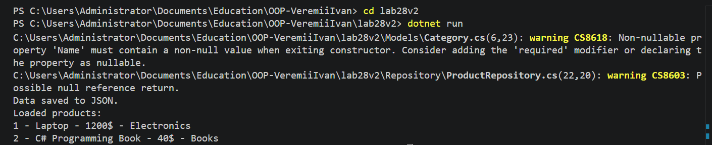

# Лабораторна робота №28
## Серіалізація об’єктів у JSON

### Мета роботи
Навчитися серіалізувати та десеріалізувати складні об’єкти у форматі JSON, зберігати дані у файл та завантажувати їх назад у програму.

### Варіант 2 — Інтернет-магазин

Класи:
- Product
- Category
- ProductRepository

### Основні методи

- Add()
- GetAll()
- GetById(int id)
- SaveToFileAsync(string filename)
- LoadFromFileAsync(string filename)

### Скріншот роботи програми

### Висновок

У ході виконання лабораторної роботи було реалізовано серіалізацію та десеріалізацію об’єктів у формат JSON з використанням бібліотеки System.Text.Json. Також було реалізовано репозиторій для збереження та завантаження даних з файлу.
