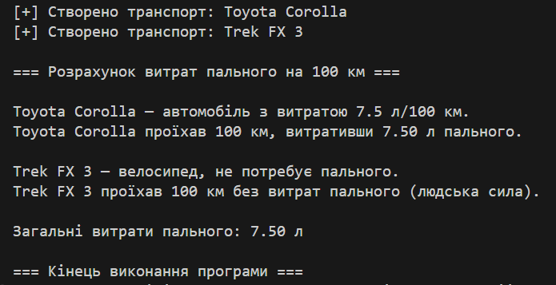

# Лабораторна робота №3
**Тема:** Наслідування: основи  
**Мета:** закріпити знання про базові класи, похідні класи, модифікатори доступу, використання `base`, поліморфізм.

---
## Виконання завдання
-  Створено абстрактний базовий клас `Transport` із віртуальним методом `Info()` та абстрактним методом `Move()`.
- Реалізовано похідні класи `Car` і `Bike`, що перевизначають методи `Move()` та `Info()`.
- Використано конструктори з викликом `base(...)`.
- Додано деструктори для демонстрації життєвого циклу об'єктів.
- Продемонстровано поліморфізм на колекції `List<Transport>`.
- Виконано обчислення витрат пального для поїздки 100 км.
- Забезпечено коректне виведення українських символів у консолі.

---

## Приклади запуску
### Вивід програми:

