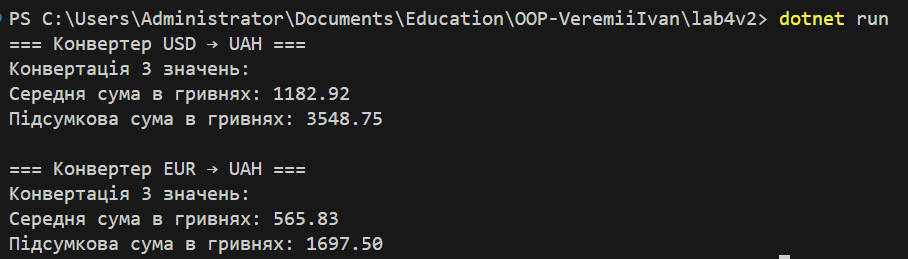

# Лабораторна робота №4
**Тема:** Абстракції та інтерфейси. Композиція та агрегація.  
**Мета:** Навчитися створювати абстрактні класи та інтерфейси, будувати ієрархії класів із використанням композиції та агрегації.

---

## Опис виконання
Реалізовано інтерфейс `IConverter`, який задає метод `Convert()`.  
Абстрактний клас `CurrencyConverter` містить спільну логіку для обчислень.  
Створено два класи:
- `UsdToUah` — конвертація доларів у гривні.
- `EurToUah` — конвертація євро у гривні.  

Клас `ConverterProcessor` демонструє **композицію**, оскільки містить об’єкт типу `CurrencyConverter` і виконує через нього обчислення.

---

## Приклад запуску програми

---

## Контрольні запитання

**1. У чому різниця між абстрактним класом і інтерфейсом?**  
Інтерфейс визначає лише набір методів (контракт), а абстрактний клас може містити як реалізацію, так і абстрактні методи.

**2. Коли краще використовувати композицію, а коли наслідування?**  
Композицію — коли об’єкт *використовує* інший;  
Наслідування — коли об’єкт *є різновидом* іншого класу.

**3. Як працює агрегація та чим вона відрізняється від композиції?**  
Агрегація — слабкий зв’язок (об’єкт може існувати самостійно).  
Композиція — сильний зв’язок (об’єкт знищується разом із власником).

**4. Чи може клас реалізовувати кілька інтерфейсів одночасно?**  
Так, у C# це дозволено.

**5. Для чого в ООП використовують інтерфейси як контракти?**  
Для забезпечення єдиної структури методів і взаємозамінності різних реалізацій.
