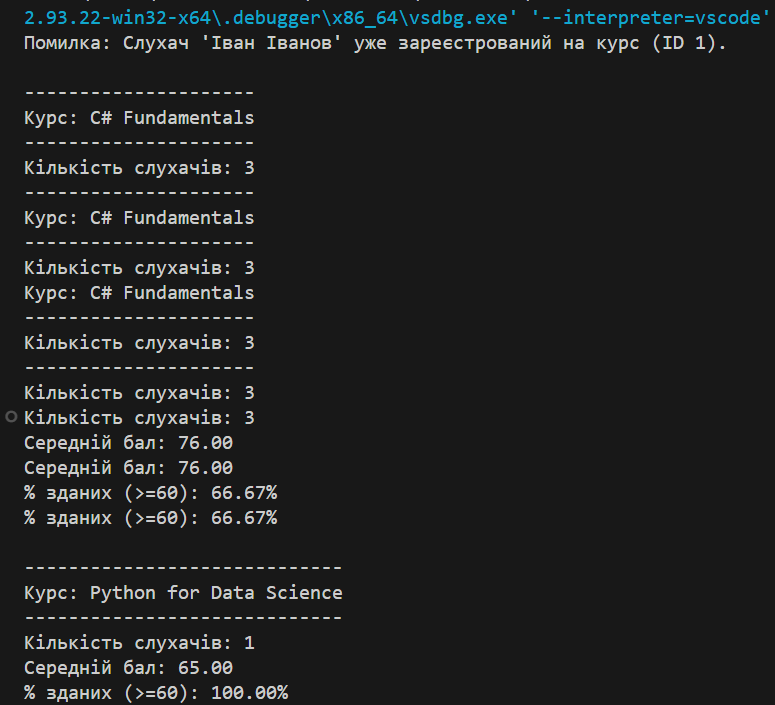

# Lab 5, Variant 2 — Курси та слухачі (Generics + LINQ + Exceptions)

**Тема:** Узагальнені типи (Generics), колекції та LINQ, обробка винятків.  
**Мета:** продемонструвати агрегацію `Course -> List<Enrollment>`, узагальнений репозиторій `Repository<T>`, 
операції LINQ для підрахунків і власний виняток `DuplicateEnrollmentException`.

---

## Запуск

---

## Що реалізовано

- **Агрегація:** `Course` містить колекцію `List<Enrollment>`.
- **Generics:** універсальний репозиторій `Repository<T>` із методом `Where`.
- **LINQ:** використано `Average`, `Count`, `Any`, `Where` для обчислень середнього балу та відсотка зданих.
- **Винятки:**
  - `DuplicateEnrollmentException` — спрацьовує при повторній реєстрації слухача на той самий курс.
- **Demo у `Program.cs`:** демонструє створення курсів, записів слухачів, статистику, обробку винятків.

Курс: C# Fundamentals
--------------------
Кількість слухачів: 3
Середній бал: 76.00
% зданих (>=60): 66.67%

Курс: Python for Data Science
-------------------------
Кількість слухачів: 1
Середній бал: 65.00
% зданих (>=60): 100.00%

Помилка: Слухач 'Іван Іванов' уже зареєстрований на курс (ID 1).

## Контрольні запитання

1. **Що таке узагальнені типи (generics)?**  
   Це шаблонні класи або методи, які дозволяють працювати з довільними типами без втрати типобезпеки.

2. **Як працює агрегація?**  
   Один об’єкт (`Course`) має посилання на інші (`Enrollment`), але ті можуть існувати окремо.

3. **Які операції LINQ використано?**  
   `Where`, `Average`, `Count`, `Any` — для фільтрації та статистики.

4. **Коли доцільно створювати власні винятки?**  
   Коли потрібно описати помилку бізнес-логіки — тут це дубльоване зарахування слухача.

## Висновок

Лабораторна продемонструвала застосування Generics і LINQ для управління курсами й слухачами з перевіркою унікальності записів.
