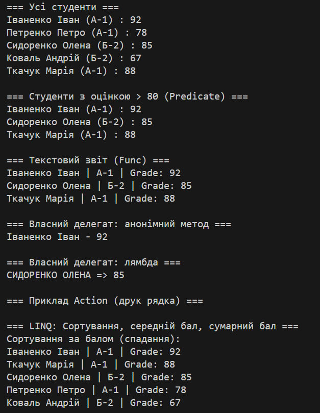
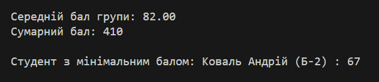

# Lab6: Lambda & Delegates (Варіант 2)

## Тема
Лямбда-вирази, анонімні функції та делегати у C#, варіант 2 (Student).

## Мета
Практичне застосування `Predicate<Student>` і `Func<Student, string>` для фільтрації та створення звіту.

## Результат
Місце для скріншоту:

