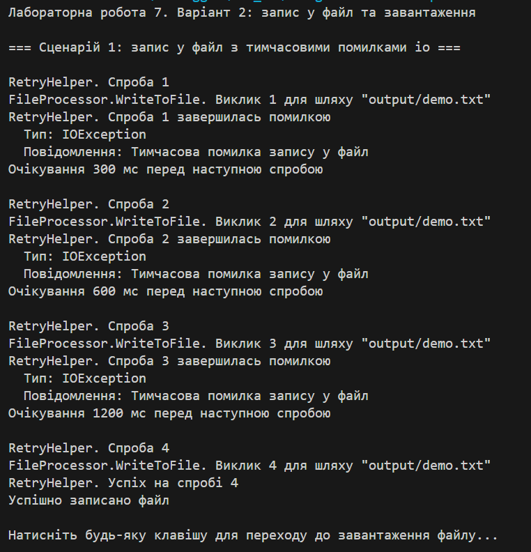
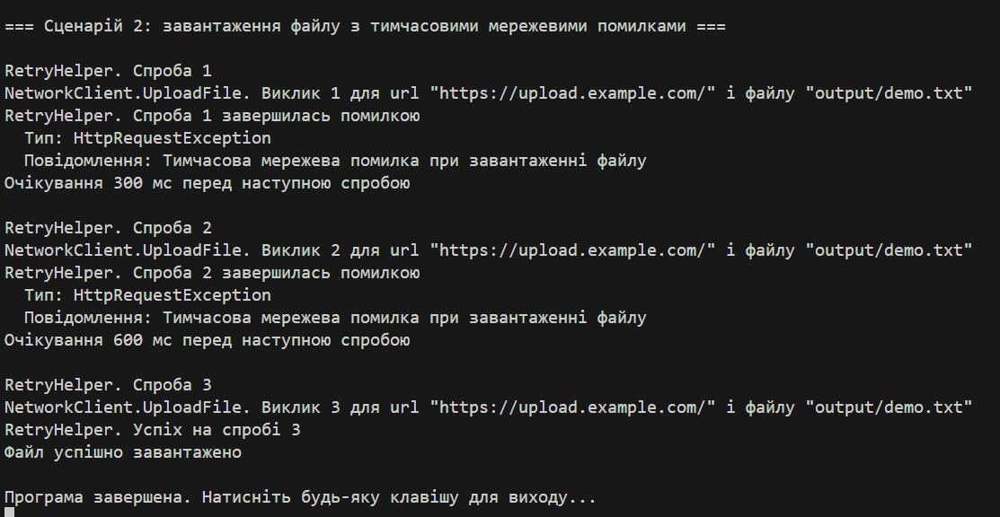

# Лабораторна робота 7
Тема: обробка io/мережевих помилок та патерн retry
Мета: навчитися обробляти помилки вводу/виводу та мережеві помилки, а також реалізувати патерн retry з експоненційною затримкою.

## Сценарій (варіант 2)
- fileprocessor: метод writeToFile(string path, string content)
  - імітує ioexception перші 3 рази, потім успішний запис
- networkclient: метод uploadFile(string url, string filePath)
  - імітує httprequestexception перші 2 рази, потім успіх
- shouldretry: повторювати тільки для ioexception та httprequestexception

## структура роботи
1. Реалізовано класи fileprocessor і networkclient
2. Реалізовано retryhelper з експоненційною затримкою
3. У main продемонстровано роботу retry з помилками та подальшим успіхом
4. Використано shouldretry для вибіркової обробки

## Контрольні питання та відповіді

### 1. Які типи винятків найчастіше виникають при роботі з файлами та мережею?
найчастішими є ioexception, filenotfoundexception, directorynotfoundexception, httprequestexception.

### 2. Поясніть принцип роботи патерну retry
retry виконує повторні спроби операції, яка тимчасово може завершуватися помилкою. його використовують, коли помилка нестабільна і операція може бути успішною пізніше.

### 3. Як реалізувати експоненційну затримку між повторними спробами?
затримка обчислюється як initialDelay * 2^(attempt-1).

### 4. Для чого потрібен делегат shouldretry у retryhelper?
він контролює, для яких помилок потрібно робити повторні спроби.

## Результат

