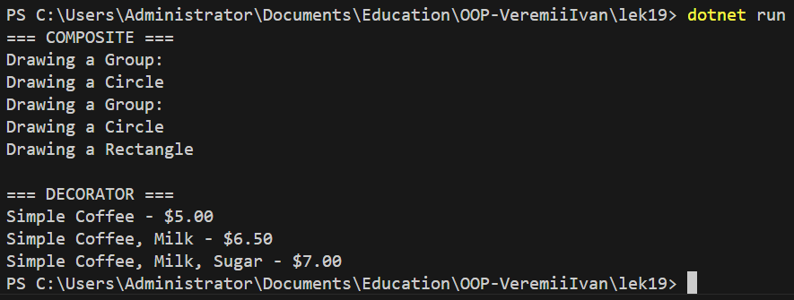

# Lecture 19 – Composite та Decorator (C#)

## Опис

У цьому проєкті реалізовано два структурні патерни проєктування:

- **Composite (Компонувальник)** – дозволяє працювати з ієрархічною структурою об'єктів як з єдиною колекцією.
- **Decorator (Декоратор)** – дозволяє динамічно додавати нову функціональність об'єкту без зміни його класу.

Проєкт демонструє обидва патерни на практичному прикладі в середовищі C# (.NET Console Application).

---

# 1. Composite

## Призначення

Патерн Composite компонує об’єкти в деревоподібну структуру для представлення ієрархії типу «частина-ціле».  
Дає можливість клієнту однаково працювати як з окремими об’єктами (Leaf), так і з їх композиціями (Composite).

## Проблема

Коли потрібно працювати з ієрархічною структурою, де:
- є окремі елементи,
- є групи елементів,
- і клієнт не повинен розрізняти їх у коді.

## Структура реалізації

- IGraphic — Component
- Circle, Rectangle — Leaf
- Group — Composite

## Переваги

- Уніфікована робота з об'єктами
- Спрощення клієнтського коду
- Гнучке розширення структури

## Недоліки

- Може ускладнювати обмеження типів
- Leaf можуть містити непотрібні методи

---

# 2. Decorator

## Призначення

Патерн Decorator дозволяє динамічно розширювати функціональність об’єкта шляхом його обгортання іншим об’єктом.

## Структура реалізації

- ICoffee — Component
- SimpleCoffee — ConcreteComponent
- CoffeeDecorator — базовий Decorator
- MilkDecorator, SugarDecorator — ConcreteDecorator

## Переваги

- Динамічне розширення функціоналу
- Відповідає принципу OCP
- Гнучке комбінування поведінки

## Недоліки

- Велика кількість дрібних об'єктів
- Важче відслідковувати порядок декораторів

---

# Результат

# Висновок

У роботі показано реалізацію структурних патернів Composite та Decorator у C#.